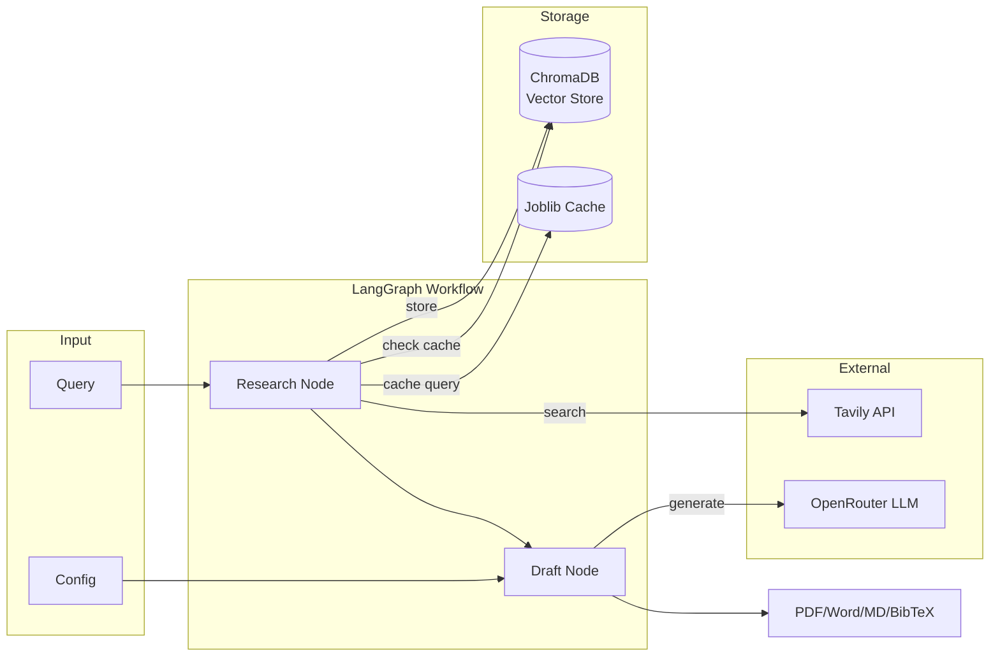

# Deep Research AI Agent

Generate comprehensive research reports on any topic using AI-powered web search and synthesis.

[](LICENSE)
[](https://www.python.org/downloads/)
[](https://streamlit.io)

## Problem

Researching a topic thoroughly is time-consuming. You need to find sources, evaluate credibility, synthesize information, and format citations—all before you even start writing.

## Solution

This tool automates the research workflow:

1. **Search** — Queries Tavily API for relevant sources (filters out social media noise)
2. **Cache** — Stores results in ChromaDB with semantic search and smart TTL
3. **Synthesize** — LLM drafts structured reports in your chosen style
4. **Export** — Download as PDF, Word, Markdown, or BibTeX

**[Live Demo →](https://deep-research-ai-agent.streamlit.app/)**

## Architecture



**Key Design Decisions:**

- **Two-node state machine**: Research and Draft are decoupled for testability
- **Vector memory with TTL**: News content expires in 3 days; evergreen in 30 days
- **Cross-encoder reranking**: Improves retrieval precision over raw similarity
- **Domain filtering**: Excludes Reddit, Twitter, TikTok by default

## Quick Start

```bash
# Clone
git clone https://github.com/saksham-jain177/AI-Agent-based-Deep-Research.git
cd AI-Agent-based-Deep-Research

# Install
pip install -r requirements.txt

# Configure
cp .env.example .env
# Edit .env with your API keys

# Run
streamlit run app.py
```

**Required API Keys:**

| Key                  | Provider                               | Purpose       |
| -------------------- | -------------------------------------- | ------------- |
| `TAVILY_API_KEY`     | [tavily.com](https://tavily.com)       | Web search    |
| `OPENROUTER_API_KEY` | [openrouter.ai](https://openrouter.ai) | LLM inference |

**Optional:**

```bash
ENABLE_VECTOR_STORE=true    # Enable ChromaDB caching
PREFER_CACHE_RESULTS=false  # Prefer cached over fresh results
```

## Configuration

| Setting         | Options                               | Default  |
| --------------- | ------------------------------------- | -------- |
| Writing Style   | Academic, Business, Technical, Casual | Academic |
| Citation Format | APA, MLA, IEEE, BibTeX                | APA      |
| Word Count      | 500–5000                              | 1000     |
| Language        | English, Spanish, German              | English  |
| Deep Research   | On/Off                                | Off      |

## Performance

| Metric             | Shallow Mode  | Deep Mode     |
| ------------------ | ------------- | ------------- |
| Sources fetched    | 5             | 20–30         |
| Avg. response time | ~15s          | ~45s          |
| Cache hit speedup  | 20–40% faster | 30–60% faster |
| Token usage        | ~2K–5K        | ~8K–15K       |

_Measured on typical queries with ChromaDB caching enabled._

## Non-Goals

This tool is **not**:

- A fact-verification engine — always verify critical claims
- Real-time streaming — uses section-by-section progress
- A citation authority — check sources before academic submission
- Optimized for legal/medical/financial advice

## Limitations

- **Rate limits**: Tavily free tier has daily limits
- **Model availability**: OpenRouter free models may be rate-limited
- **Citation accuracy**: Auto-generated citations should be manually verified
- **Language support**: Best results in English; ES/DE are functional but less tested

## Project Structure

```
├── app.py              # Streamlit UI
├── main.py             # LangGraph workflow orchestration
├── research_agent.py   # Tavily search + vector store integration
├── draft_agent.py      # LLM prompting and section generation
├── vector_store.py     # ChromaDB with reranking and TTL
├── cost_estimator.py   # Token/cost estimation with uncertainty
├── citation_formatter.py # APA/MLA/IEEE/BibTeX generation
└── tests/              # Pytest test suite
```

## Contributing

1. Fork the repository
2. Create a feature branch (`git checkout -b feature/your-idea`)
3. Run tests (`pytest tests/ -v`)
4. Submit a pull request

See [CONTRIBUTING.md](CONTRIBUTING.md) for detailed guidelines.

## License

MIT License — use freely for personal or commercial projects.

---

**Questions?** [Open an issue](https://github.com/saksham-jain177/AI-Agent-based-Deep-Research/issues) or [start a discussion](https://github.com/saksham-jain177/AI-Agent-based-Deep-Research/discussions).
